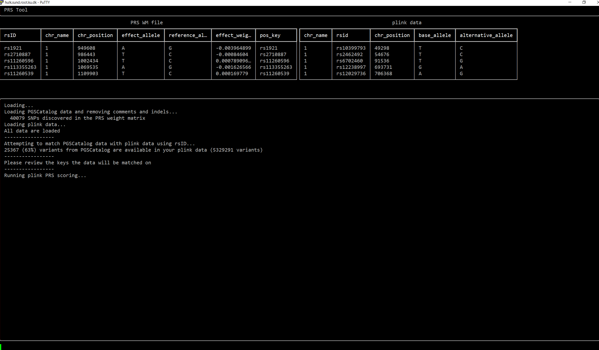

# Tool to calculate PRS from PGSCatalog using your genetic data



# TL;DR

ssh to hulk, download PGSCatalog's PRS weight matrix and run:
```bash
PYTHON="/home/mvn373/fast/tools/python36/bin/python3"
SCRIPT="/home/mvn373/fast/prs-workshop/apply-pgscatalog-prs-stable.py"
PLINK_PREFIX="path to plink data, with common prefix, see example below"
PGSCATALOG_FILE="file downloaded from pgscatalog, may be .txt or gzipped"
OUT_PATH="path and prefix for the output files, see example below"
$PYTHON -u $SCRIPT --genetic $PLINK_PREFIX --prs-wm $PGSCATALOG_FILE --out $OUT_PATH
```

# Detailed description

NB. This version is meant to be run on *hulk* server of CBMR. More general-use tool is to come.

### Results
It creates a file with the PRS values for the individuals. To do so, it aligns the files and runs the plink in the proper way.

### Side-effects
It will:
- unpack the file from PGSCatalog, if it was gzipped.
- create an output .prs file,
- produce an intermediate file next to the initial PGSCatalog file,

### Input:
- PGSCatalog file  
File must provide beta or log(OR) (but not *just* OR).
- plink data

### How to start using it:
Right now it works interactively (I suggest you run it on hulk. Use your terminal full-screen, and don't resize it (I will make it dynamically adopt to the screen size later)).  

1. Log on the hulk
2. Download the file from PGSCatalog and locate your plink files
3. Run the code and follow the prompts

### How to run the tool
Here is a general command to run the code:
```bash
PYTHON="/home/mvn373/fast/tools/python36/bin/python3"
SCRIPT="/home/mvn373/fast/prs-workshop/apply-pgscatalog-prs-stable.py"
PLINK_PREFIX="path to plink data, with common prefix, see example below"
PGSCATALOG_FILE="file downloaded from pgscatalog, may be .txt or gzipped"
OUT_PATH="path and prefix for the output files, see example below"
$PYTHON -u $SCRIPT --genetic $PLINK_PREFIX --prs-wm $PGSCATALOG_FILE --out $OUT_PATH
```

It is using my specific version of python, so use the python and the script paths provided, and supply the rest three of the paths. As a matter of nice style, please use the absolute path for the paths - this will make everything run nicer.

You need to supply three arguments:
* *--genetic* - prefix for your plink data. For example, for a plink trio of files like "/folder/file.bed", "/folder/file.bim", and "/folder/file.fam" it would be "--genetic /folder/file".
* *--prs-wm* - file from PGSCatalog.
* *--out* - prefix for the output. For example, if you want an output file "/outfolder/out.prs" it would be "--out /outfolder/out".

### Running
Once you start, it will prompt you at the bottom of the screen to provide the information. You will need to:
supply the names of the columns for beta and effect allele in the PGSCatalog data
choose if your plink data are using rsid or chrom:pos as identifiers (more options and better alignment will be done in the future)
supply the names of the columns for rsid OR chromosome+position in the PGSCatalog data
make the final confirmation

### Conscious limitation
If your plink data does not have at least 50% of the variants from the PGSCatalog file, the tool won't allow you to run the PRS calculation, as the resulting scores might be too unreliable.
